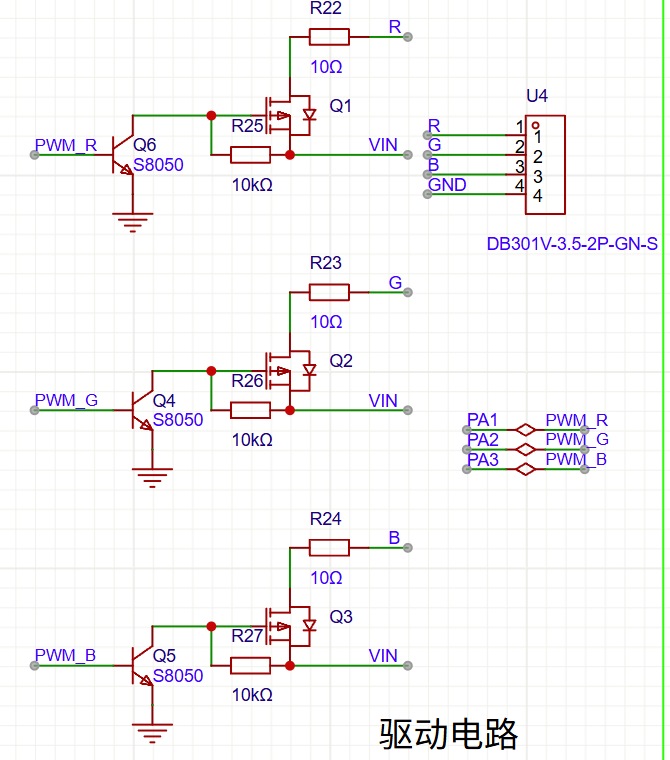
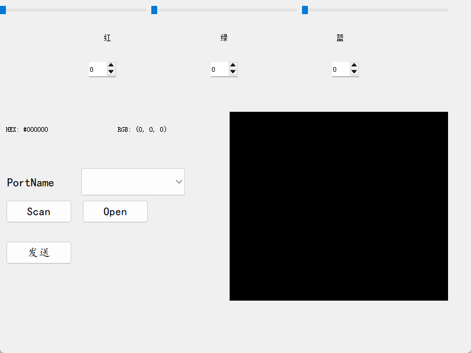
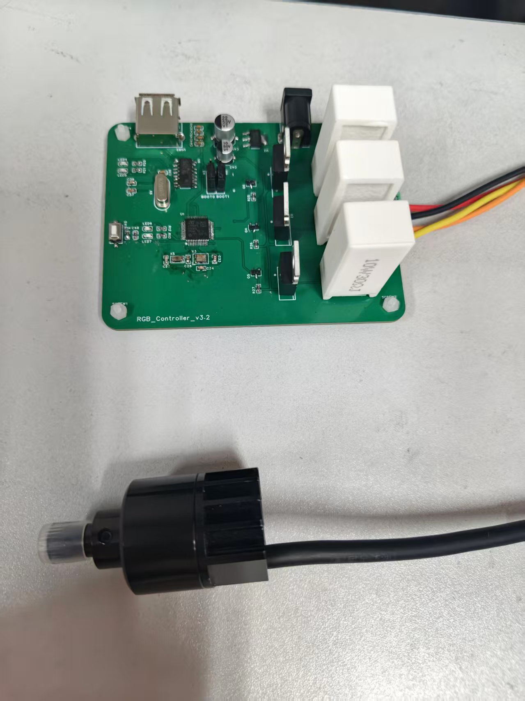

# RGB_controller

——一款rgb点光源工控板

### 基本架构：

1.基于STM32F103输出三路1kHz PWM，通过PMOS管驱动三颗1W RGB点光源，实现颜色混合控制。

2.设计串口通信协议，与QT（C++）开发的上位机可视化界面交互，支持单通道/多通道亮度独立调节。

3.硬件设计：12V输入，输出限流300mA；采用水泥电阻+散热片解决高功率散热问题

### 原理图:



原理：当pwm处于高电平状态时，三极管导通，pmos管的g级被拉低，开启mos管，进而输出电压。

当pwm处于低电平时，三极管不导通，pmos管的g级悬空，处于高阻态，mos管关断，无法输出电压。

通过改变占空比来改变输出的电压，进而实现光源的亮度变化。

### 上位机：



通过串口设备可实现实时通信，若采用总线式通信，则能一拖多，对多个点光源进行实时调节。

```
#发送规定的数据信息
void MainWindow::send_str(int rgb_int,uint16_t channel)
{
    if(!serial->isOpen())
    {
        return;
    }
    QByteArray my_arr = QByteArray::fromHex(QString("%1").arg(rgb_int, 4, 16, QChar('0')).toLatin1());
    QByteArray tmp = QByteArray::fromHex(QString("%1").arg(channel, 2, 16, QChar('0')).toLatin1());
    my_arr.prepend(tmp);
    my_arr.prepend(QByteArray::fromHex("1F"));
    my_arr.append(QByteArray::fromHex("FE"));
    serial->write(my_arr);
    qDebug()<<my_arr<<my_arr.size();
}//规定一个数据包为“1F 01 0000 FE”（包头 颜色类型 亮度 包尾）
```

转换公式：

```
#由于微控制器的pwm分辨率为12位，追求四舍五入应加上127，映射到0-4095的范围
(value * 4095 + 127) / 255
```

**每个色度单位对应的PWM增量4095 ÷ 255 ≈ 16.0588，但是由于电压变化带来的色度变化并不是均匀的，是非线性的，所以这里的误差会在某个峰值达到最大，最大误差不超过0.5个增量。**

### 实物图片：


